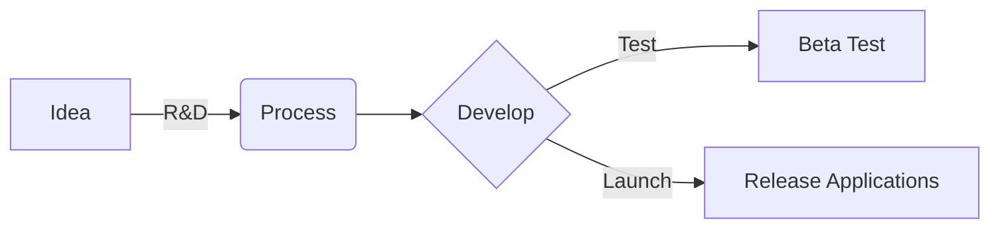
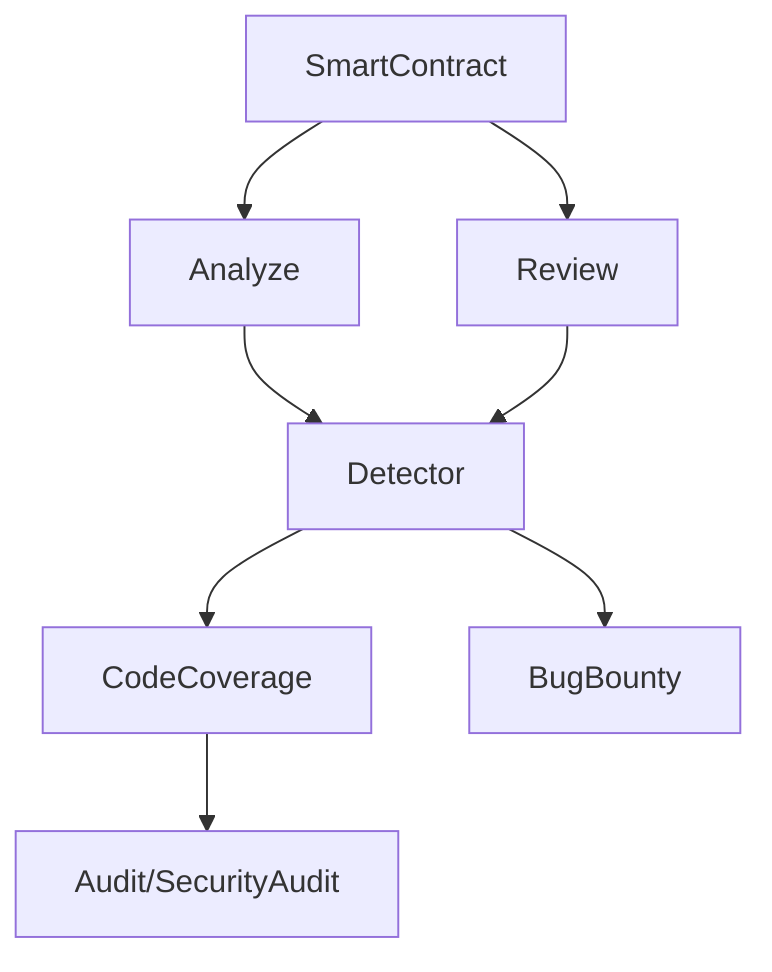
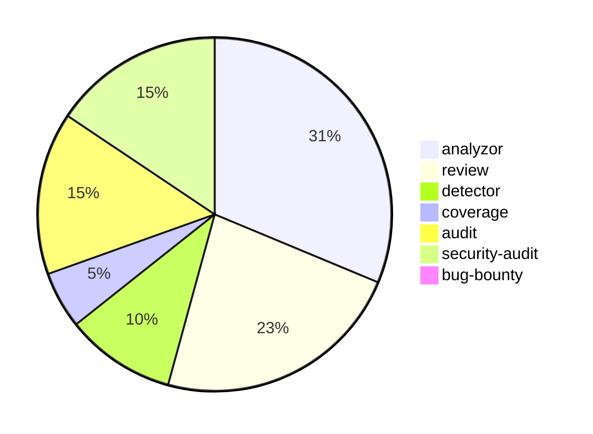

```ascii
 ______  _                _                           
(____  \| |              | |           _              
 ____)  ) |_   _  ____   | |      ___ | |_ _   _  ___ 
|  __  (| | | | |/ _  )  | |     / _ \|  _) | | |/___)
| |__)  ) | |_| ( (/ /   | |____| |_| | |_| |_| |___ |
|______/|_|\____|\____)  |_______)___/ \___)____(___/ Security Audit SmartContracts, 2022-2023
```
As soon : [lotuschain.org](https://lotuschain.org)

# BlueLotus


**Blue Lotus**, also known as **LotusChain**, is at the forefront of developing and integrating decentralized applications (dapps) that leverage blockchain technology to revolutionize various industries. Our dapps, including **dCDN**, **ALT**, **ALP**, **ALT-IDM**, and **ALT-Audit**, showcase our commitment to utilizing the decentralized nature of blockchain networks to provide more efficient, secure, and scalable solutions.\
[**LotusChain Product**] - [shoot pitch](https://github.com/blue-lotus-org/lotus-products)

- **Github**: [Repositories](https://github.com/blue-lotus-org)
- **Publish**: [Application](https://github.com/blue-lotus-lab)
- **Linkedin**: [Blue Lotus](https://www.linkedin.com/company/bluelotus-corp)
- **Home**: [Lotus Chain](https://lotuschain.org)
- **Telegram News**: [LotusChain](https://t.me/lotuschain_org)
<div align="right">
  <a href="https://www.linkedin.com/company/bluelotus-corp" target="_blank">
    
  </a>
     <a rel="license" href="http://creativecommons.org/licenses/by-nc-nd/4.0/">
          
     </a>
</div>

Overall, Blue Lotus' ownership of these dapps showcases the dedication to pushing the boundaries of blockchain technology and its applications. By harnessing the power of decentralization, we aim to provide innovative solutions that solve real-world problems and improve various aspects of industries such as content delivery, decentralized identities, messaging, and smart contract auditing.

<p align="center">
  <a href="https://github.com/blue-lotus-org">
    
  </a>
</p>

### Services:
Blue Lotus, also known as LotusChain, owns and operates several decentralized applications (dapps) that aim to leverage blockchain technology for various purposes. Here is an overview of the dapps owned by Blue Lotus:

1. **dCDN "Decentralized CDN"**: Blue Lotus proposes the development and integration of a decentralized Content Delivery Network (dCDN) using the InterPlanetary File System (IPFS). The dCDN aims to revolutionize the traditional CDN model by utilizing the decentralized nature of IPFS to provide a more efficient, secure, and scalable content delivery solution.\
[read more](https://github.com/blue-lotus-org/lotus-products/tree/main/dCDN)

2. **ALT "At Live Token"**: Blue Lotus intends to integrate ALT (At Live Token) into a decentralized application (Dapp) ecosystem. ALT is an ERC721 token that serves as a protocol for creating decentralized identities for users. By incorporating ALT into a Dapp, Blue Lotus can leverage its unique features and benefits to enhance user experiences and enable seamless interactions on EVM blockchains.\
[read more](https://github.com/blue-lotus-org/lotus-products/tree/main/ALT)

3. **ALP "At Live Token Profile"**: Blue Lotus proposes integrating ALT (At Live Token) into the ALP (ALT Profile) Dapp ecosystem. Similar to the previous proposal, ALT serves as a protocol for creating decentralized identities for users. By integrating ALT into ALP, Blue Lotus aims to enhance user experiences and enable seamless interactions on EVM blockchains.\
[read more](https://github.com/blue-lotus-org/lotus-products/tree/main/ALP)

4. **ALT-IDM "All EVM Input Data Messages (IDM)"**: Blue Lotus proposes the development and launch of a decentralized application (Dapp) called "Ethereum ALT IDM (Input Data Messages)" on both EVM and Non-EVM blockchains. This Dapp will enable users to send and receive internal messages within the Ethereum Virtual Machine (EVM) where the Dapp is deployed. It will be compatible with all EVM blockchains and available on both main net and test net environments.\
[read more](https://github.com/blue-lotus-org/lotus-products/tree/main/IDM)

5. **ALT-Audit "Smartcontract Audit Service (AI)"**: Blue Lotus plans to integrate a decentralized AI for auditing smart contracts into their Dapp. This AI will provide an automated and efficient way to detect problems and vulnerabilities in smart contracts. The Dapp will prioritize user privacy and security by not collecting any user data.\
[read more](https://github.com/blue-lotus-org/lotus-products/tree/main/Audit)

These dapps owned by Blue Lotus aim to harness the power of blockchain technology, decentralized systems, and smart contracts to provide innovative solutions across various domains such as content delivery, decentralized identities, messaging, and smart contract auditing.

<p align="center">
  <a href="https://github.com/blue-lotus-org">
    
  </a>
</p>

[GitHub]: https://github.com/blue-lotus-org
[Linkedin]: https://github.com/blue-lotus-org

#

### Productions 


#

### Blue Lotus


#

### 04-2021 to 04-2023


#

<div align="center">
 
</div>

## Reach Us

|||||
| --- | --- | --- | --- |
| **Github** | [Repositories](https://github.com/blue-lotus-org) | **Linkedin** | [Blue Lotus](https://www.linkedin.com/company/bluelotus-corp) |

|||||
| --- | --- | --- | --- |
| **BlueLotus** | [LotusChain](https://lotuschain.org) | **Contact us** | <contact@lotuschain.org> |

|||||||
| --- | --- | --- | --- | --- | --- |
| **Mosi** | [github](https://github.com/mosi-sol) | **Sepehr** | [github](https://github.com/sepehr310) | **Sepentaminu** | [github](https://github.com/sepentaminu) |

---

<div align="right">
     <sub>
          This work is licensed under a <a rel="license" href="http://creativecommons.org/licenses/by-nc-nd/4.0/">Creative Commons Attribution-NonCommercial-NoDerivatives 4.0 International License</a>.
     </sub>
</div>
