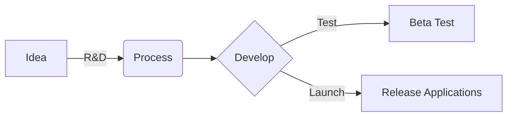
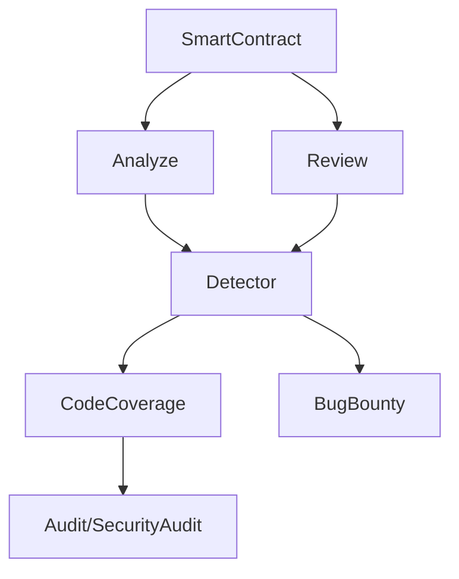
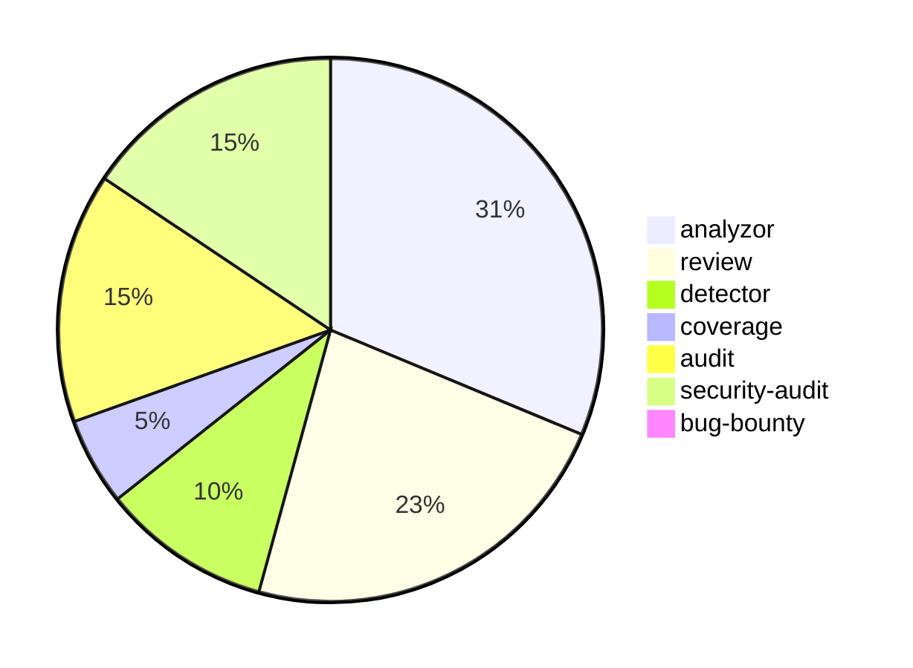

Focus On Healthcare: LOTUS HEALTH (Breast Cancer Predict & Diagnosis)
```ascii
 ______  _                _                           
(____  \| |              | |           _              
 ____)  ) |_   _  ____   | |      ___ | |_ _   _  ___ 
|  __  (| | | | |/ _  )  | |     / _ \|  _) | | |/___)
| |__)  ) | |_| ( (/ /   | |____| |_| | |_| |_| |___ |
|______/|_|\____|\____)  |_______)___/ \___)____(___/ Smart Startup Studio
```
We are here : [lotuschain.org](https://lotuschain.org)

# BlueLotus


**Welcome to Blue Lotus | AI-Powered Innovation & Startup Studio**

## About Us

Blue Lotus, also known as LOTUSCHAiN, is a dynamic Startup Studio at the forefront of AI-driven innovation. We've evolved from our roots in blockchain security and AI automation to become a powerhouse for developing scalable AI solutions across healthcare, security, and business automation sectors.

<!--[**LotusChain Product**] - [shoot pitch](https://github.com/blue-lotus-org/lotus-products)-->

- **Github**: [Repositories](https://github.com/blue-lotus-org)
- **Publish**: [Application](https://github.com/blue-lotus-lab)
- **Linkedin**: [Blue Lotus](https://www.linkedin.com/company/bluelotus-corp)
- **Home**: [Lotus Chain](https://lotuschain.org)
- **Telegram News**: [LotusChain](https://t.me/lotuschain_org)
- **Blog**: [Medium](https://lotuschain.medium.com/)
<div align="right">
  <a href="https://www.linkedin.com/company/bluelotus-corp" target="_blank">
    
  </a>
</div>

## Our Journey

- **2023:** Focused on blockchain security, AI automation, and open-source development.
- **2024:** Transitioned to a Startup Studio, launching AI-driven ventures.
- **2025:** Expanding into AI-powered SaaS solutions.
- **2026+:** Developing Lotus OS and pursuing strategic exits & mergers.

<p align="center">
  <a href="https://github.com/blue-lotus-org">
    
  </a>
</p>

## Key Initiatives

- **Oxin Surgery:** Revolutionizing cross-border healthcare in the Middle East.
- **Health Mentor:** AI-driven health & lifestyle coaching.
- **Lotus ASR:** Cutting-edge multilingual speech recognition supporting 23 languages.
- **Generative AI Development Suite:** Automating full-stack app creation.
- **Lotus Smart Security:** AI-based security auditing for Solidity smart contracts.
- **Lotus Research Assistant:** AI research tool with access to millions of articles and papers.
- **Lotus Agent:** High-tech AI-Agents peripherals with custom agent generation.

## Our Vision

At Blue Lotus, we believe AI is a tool to enhance human capabilities, not replace them. Our focus on public sectors, healthcare, and accessibility ensures that our innovations drive real-world impact while maintaining transparency and security.

## Open-Source Contributions

We're committed to fostering innovation through open-source development. Our GitHub repositories showcase a range of projects, including:

- AI agent generators using LlamaIndex and LangChain
- Smart contract development and auditing tools
- Developer resources and utilities

## Join Our Innovation Journey

Whether you're an entrepreneur, developer, or investor, we invite you to be part of our ecosystem:

- Explore our [GitHub repositories](https://github.com/orgs/blue-lotus-org/repositories)
- Visit our [website](https://lotuschain.org/) to learn more
- Connect with us for partnership opportunities

Let's shape the future of AI-driven innovation together!

<p align="center">
  <a href="https://github.com/blue-lotus-org">
    
  </a>
</p>

[GitHub]: https://github.com/blue-lotus-org
[Linkedin]: https://github.com/blue-lotus-org

#

## Our Free & Opensource Projects (AI)
> These apps are flexible and raw. Easily modify and put your own backend on top of it. Just for ideation and even development. Enjot it!

|---||---|
|---|---|---|
| [](https://github.com/blue-lotus-org/safe-os) |||
| [Lotshot - Backend solution](https://github.com/blue-lotus-org/lotshot/) |---| [Python virtual environment manager by C++](https://github.com/blue-lotus-org/pyp-cpp) |
| [Lotus Vibe Code AI Agent](https://github.com/blue-lotus-org/LotusCoder) |---| [Node Package status](https://github.com/blue-lotus-org/package-updater) |
|---|---|---|
| [UML V1](https://github.com/blue-lotus-org/UML) || [UML V2](https://github.com/blue-lotus-org/UML-v2) |
| [Jobby (Apply Board)](https://github.com/blue-lotus-org/jobby) || [Database Organizer](https://github.com/blue-lotus-org/Database-Organizer) |
| [Lamaindex Agent Generator](https://github.com/blue-lotus-org/LamaGen) || [Langchain Agent Generator](https://github.com/blue-lotus-org/LangGen) |
| [Mistral Agent Pipeline](https://github.com/blue-lotus-org/Agent-Pipeline) || [Github Tree](https://github.com/blue-lotus-org/mistree) |
| [Content Editor (Word)](https://github.com/blue-lotus-org/mistral-content-editor) || [Knowledge Graph Controler](https://github.com/blue-lotus-org/knowledge) |
| [Mistral Agent Builder](https://github.com/blue-lotus-org/mistral-agent-builder) || [Gemini Agent Builder](https://github.com/blue-lotus-org/gemini-agent-generator) |
| [AI Agent Agency (Genesis)](https://github.com/blue-lotus-org/ai-agents-agency) ||  |
|---|---|---|
| [Radiology Report Form](https://github.com/blue-lotus-org/Radiology-Report-Form) || [Gnome Extension Generator](https://github.com/blue-lotus-org/gnome-extension-generator) |
| [Equity Manager "Captable Generator"](https://github.com/blue-lotus-org/captable-generator) |||
|---|---|---|
| [Deep Search](https://github.com/blue-lotus-org/deep-search) || [Trend Search Assistant](https://github.com/blue-lotus-org/trend-search) |
| [Business Doc Generator](https://github.com/blue-lotus-org/business-doc-generator) || [Content Editor "Co-Pilot"](https://github.com/blue-lotus-org/content-copiloting) |
| [Business Insight](https://github.com/blue-lotus-org/business-insight) || [Knowledge Base](https://github.com/blue-lotus-org/knowledge-base) |
| [Automata Deep Research](https://github.com/blue-lotus-org/automata-deep-search) |||
|---|---|---|
| [Wolfram Alpha - AI Math Teacher](https://github.com/blue-lotus-org/wolfram-gen) || [NeoLogy - Simulation of life](https://github.com/blue-lotus-org/neology-life) |
|---|---|---|
| [MCP](https://github.com/blue-lotus-org/MCP) || [Linux Terminal AI-Moderator](https://github.com/blue-lotus-org/mysterminal) |
| [Smartcontract Pipline Agent](https://github.com/blue-lotus-org/Smartcontract-AI-Agentic-System) || [Linux Kernel Optimizer - Live Edition](https://github.com/blue-lotus-org/LinuxKernelOptimization) |
| [Incredible Prompts](https://github.com/blue-lotus-org/prompt) ||  |
|---||---|

---

### Productions 


#

### Blue Lotus


#

### 04-2021 to 04-2023


#

<div align="center">
 
</div>

## Reach Us

|||||
| --- | --- | --- | --- |
| **Github** | [Repositories](https://github.com/blue-lotus-org) | **Linkedin** | [Blue Lotus](https://www.linkedin.com/company/bluelotus-corp) |

|||||
| --- | --- | --- | --- |
| **BlueLotus** | [LotusChain](https://lotuschain.org) | **Contact us** | <contact@lotuschain.org> |

|||||||
| --- | --- | --- | --- | --- | --- |
| **Mosi** | [github](https://github.com/mosi-sol) | **Sepehr** | [github](https://github.com/sepehr310) | **Sepentaminu** | [github](https://github.com/sepentaminu) |

---

**Smartcontract Security Audit Based On Following Links:**


Smart Contract Weakness Classification (SWC):

    https://swcregistry.io/

Solidity Vulnerabilities Dataset:

    https://www.kaggle.com/datasets/shivam017arora/smart-contract-audit-reports-dataset
    https://www.kaggle.com/code/yousefsaeedian/analysis-of-smart-contracts-in-blockchain/input

Top Solidity Vulnerabilities:

    https://github.com/kadenzipfel/smart-contract-vulnerabilities

Standards (EEA EthTrust Security Levels Specification):

    https://github.com/ComposableSecurity/SCSVS

Articles/Journals:

    https://www.mdpi.com/2624-800X/2/2/19
    https://www.ncbi.nlm.nih.gov/pmc/articles/PMC7516633/
    https://www.researchgate.net/publication/379726984_Vulnerabilities_of_smart_contracts_and_mitigation_schemes_A_Comprehensive_Survey
    https://arxiv.org/html/2403.19805v2

Papers Directory:

    https://github.com/hzysvilla/Academic_Smart_Contract_Papers


---

<div align="right">
     <sub>
          This work is licensed under a <a rel="license" href="http://creativecommons.org/licenses/by-nc-nd/4.0/">Creative Commons Attribution-NonCommercial-NoDerivatives 4.0 International License</a>.
     </sub>
</div>


